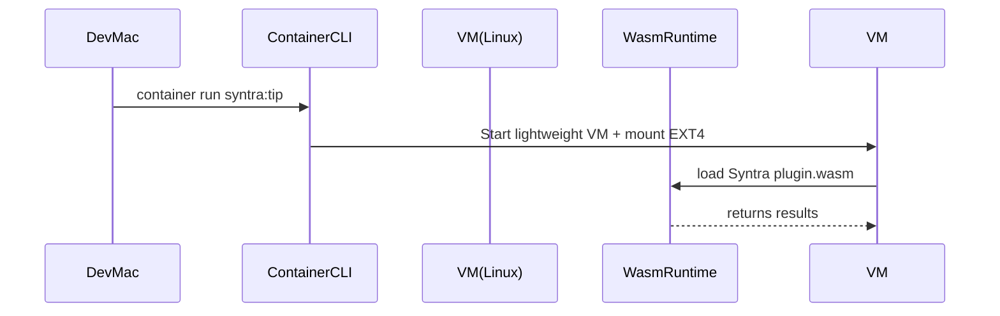

# Cross-Platform Containerization \& WebAssembly Blueprint for SyntraFoundation

A comprehensive, end-to-end integration plan that turns Syntra into a portable, sandbox-ready AI runtimeon macOS, Linux, serverless edge, and the browser—leveraging Apple’s new Containerization framework, OCI-compliant images, and Swift ↔ Wasm tooling.

## Overview

Syntra now spans three execution worlds:

1. **Native macOS (Apple Silicon)** Runs lightweight Linux containers via Apple’s open-source Containerization framework and the `container` CLI [^1][^2].
2. **Desktop \& CI Linux** Uses standard Docker/Podman to build and run identical OCI images [^3][^4].
3. **Universal WebAssembly (Wasm)**
a. **Host mode** – Embed a Wasm runtime (WasmKit/Wasm3/Wasmer) in Swift/Python processes for sandboxed plug-ins [^5][^6][^7].
b. **Guest mode** – Compile Swift modules to Wasm/WASI with Swift 6.2 SDKs for browser, edge, or in-container use [^8][^9][^10].

This document describes the **architecture**, **toolchains**, **in-repo directory layout**, **build pipelines**, **security model**, and **CI/CD workflows** required to make the whole stack “just work.”

## 1. Repository Layout Additions

| Path | Purpose | New/Existing |
| :-- | :-- | :-- |
| `/ContainerSpecs/` | OCI image manifests, Dockerfiles, `Containerfile` (Apple) | 🆕 |
| `/WebAssembly/Host/` | Swift \& Python runtimes (`WasmKit`, `pywasm3`) | 🆕 |
| `/WebAssembly/Guest/` | SwiftWasm source targets (`SyntraCoreWasm`) | 🆕 |
| `/Scripts/build_container.sh` | One-shot build for both `container` (macOS) \& Docker | 🆕 |
| `/Scripts/build_wasm.sh` | Cross-compiles Swift → Wasm, minifies with `wasm-opt` | 🆕 |
| `.github/workflows/docker.yml` | Linux build/test, pushes to GHCR | 🆕 |
| `.github/workflows/macos_container.yml` | macOS 26 CI job, builds with Containerization | 🆕 |

## 2. macOS 26 Native Containers (Apple Containerization)

### 2.1 Prerequisites

- Apple Silicon Mac running macOS 26 Developer Beta [^11].
- Xcode 26 + Static Linux SDK (`make cross-prep` per repo docs) [^12].
- Install Container CLI:

```bash
brew tap apple/container
brew install apple/container/container
container system start          # starts XPC helpers
```


### 2.2 Building Syntra OCI Image on Mac

```
container build \
  --tag syntra:local-arm64 \
  --memory 4GB --cpus 4 \
  --file ContainerSpecs/Dockerfile.mac .
```

*Key points*

- The same Dockerfile works—`container` automatically consumes it [^13].
- Cross-compiles server binary with `--arch arm64`.
- Produces an OCI-compliant image stored locally at `~/Library/Containers/com.apple.containerd/...`.


### 2.3 Running \& Networking

```bash
container run -t -i \
  --publish 8081 \
  syntra:local-arm64 \
  ./SyntraServer
```

`container list` reveals a per-container IP; use that for testing [^13].

## 3. Linux/Docker Compatibility Path

Even though macOS 26 has a native runtime, **CI servers** and **cloud hosts** still require Docker/Podman.

### 3.1 Multi-Arch Build (arm64 + amd64)

```bash
docker buildx create --name syntra-builder
docker buildx build \
  --platform linux/arm64,linux/amd64 \
  --tag ghcr.io/infektyd/syntra:$(git rev-parse --short HEAD) \
  --push .
```

*Notes*

- Uses QEMU for cross build, or Apple `container` for arm64 and `--arch amd64` flag for x-compile [^13].
- Image pushed to GHCR; macOS `container` can pull the same tag (OCI spec).


### 3.2 Local Development Shortcut

```bash
docker compose -f ContainerSpecs/docker-compose.yml up db app
```

Follows Vapor-style multi-service pattern—Postgres + Syntra—per GfG \& Kodeco guides [^3][^14].

## 4. Embeddable Wasm Runtime (Host Mode)

### 4.1 Swift Side (Wasmer / WasmKit)

```swift
import WasmKit   // add to Package.swift

let engine   = WasmEngine()
let module   = try engine.loadWasm("Plugins/sentiment.wasm")
let sumFunc  = try module.function("fib", returning: Int32.self, params: Int32.self)
print(sumFunc(24))   // 46368
```

- WasmKit = pure-Swift runtime, no Foundation dependency, great for iOS 26 [^5][^15].
- Alternative: SwiftyWasmer for Wasmer C API [^7].


### 4.2 Python Side (pywasm3)

```python
import wasm3

env = wasm3.Environment()
rt  = env.new_runtime(1024)
mod = env.parse_module(open("plugins/valon.wasm","rb").read())
rt.load(mod)
calc = rt.find_function("calc_drift")
print(calc(7,3))
```

Package: `pip install pywasm3` [^16][^17].

### 4.3 Security \& Resource Limits

- Use Wasmer “metering” middleware for CPU/step quotas [^18].
- Limits configured per plugin in `config.json`:

```json
"wasm_limits": { "max_mem": 32_000_000, "max_ms": 50 }
```


## 5. Compiling Syntra Modules to Wasm (Guest Mode)

### 5.1 Swift SDK Installation

```bash
swiftly install 6.2-snapshot
swiftly use 6.2-snapshot
swift sdk install $(swiftwasm_download_url)   # per step-by-step [^3]
swift sdk list   # ensure swift-6.2-wasm appears
```


### 5.2 Build Script

```bash
cd WebAssembly/Guest
swift build -c release \
  --swift-sdk swift-6.2-wasm \
  --product SyntraCoreWasm \
  --static-swift-stdlib
wasm-opt -Os .build/wasm32-unknown-wasi/release/SyntraCoreWasm.wasm \
  -o SyntraCoreWasm.opt.wasm
```


### 5.3 Distribution Options

| Target | Packaging | Registry | Runtime |
| :-- | :-- | :-- | :-- |
| **Browser** | JS + `micro-wasi` loader [^19] | — | Browser’s JS |
| **Edge/Serverless** | WASI module | ORAS push to OCI registry (`oras push`) [^20][^21] | Wasmtime, Spin [^22] |
| **Inside Syntra Container** | Copy `.wasm` into image | part of `/opt/plugins` | WasmKit runtime |

## 6. Apple Containerization + Wasm Together

1. **macOS developer** pulls image with `container pull ghcr.io/...:wasm`.
2. Inside the Syntra Linux VM the server uses **Wasmer** to execute plug-ins compiled from Swift or Python as Wasm modules.
3. External users can pull the **same image via Docker**; functionality identical.

Flow:




## 7. Continuous Integration Matrix

| Job | Runner | Artifacts | Key Steps |
| :-- | :-- | :-- | :-- |
| `macos_container.yml` | macOS 26 | `syntra-arm64.oci` | `container build`, `container images push` |
| `docker.yml` | Ubuntu-22.04 | `syntra-multiarch.tar` | `docker buildx`, unit tests |
| `wasm.yml` | Ubuntu | `SyntraCoreWasm.opt.wasm` | `swift build --swift-sdk wasm`, run Wasmtime unit tests |
| `docs.yml` | Any | `Guides HTML` | Build Jazzy docs inc. Containerization \& Wasm examples |

All three pipelines push to **GitHub Releases** and version-tagged registries.

## 8. Security \& Supply Chain

1. **SBOM \& Signing**
    - Use `syft` to generate SBOM for each OCI image.
    - Sign Wasm artifacts \& container digests with Sigstore (cosign).
2. **Sandboxing**
    - Wasm plugin runtime runs with Wasmer `--dir=/data` or “no-IO” policy.
3. **Static Linking**
    - `vminitd` in Containerization already static; our Swift server built with `--static-swift-stdlib` for minimal attack surface [^1].
4. **Network Isolation**
    - Each container gets dedicated IP; Syntra loads env vars for configured outbound rules.
5. **Reproducible Builds**
    - All Docker/Container builds use pinned base images (`swift:6.2-noble@sha256:...`) [^23].

## 9. Developer Experience Upgrades

### 9.1 VS Code / Cursor IDE Extensions

| Extension | Use | Notes |
| :-- | :-- | :-- |
| `vscode-swift` | Swift syntax + SwiftWasm debug | auto-detects `--swift-sdk wasm` builds [^10] |
| `Container` | Apple container CLI integration | Start/stop VM \& inspect logs |
| `wasm-lens` | View Wasm sections \& WIT imports | validate plugin ABI |

### 9.2 Make Targets

```makefile
make container          # builds OCI image on macOS if available
make docker             # builds multi-arch on Linux
make wasm               # produces SyntraCoreWasm.opt.wasm
make test               # runs Swift, Python, Wasm unit tests
```


## 10. Roadmap Milestones (12 Weeks)

| Week | Goal | Deliverable |
| :-- | :-- | :-- |
| 1-2 | **Minimal container** boots on macOS 26; server responds | `container run syntra:hello` |
| 3-4 | Docker multi-arch images green in CI | GHCR tags for `arm64` \& `amd64` |
| 5-6 | Wasm host runtime executes sample plugin | `calc_drift.wasm` demo |
| 7-8 | SwiftWasm guest compilation for core logic | `SyntraCoreWasm.opt.wasm` shipped |
| 9-10 | Cross-platform end-to-end tests (macOS container, Docker, Wasmtime) | CI badge ✅ |
| 11 | Documentation, SBOM, code signing | `docs.swift` site |
| 12 | **0.1.0 Release** – public image + Wasm plugins | Announcement blog post |

## 11. Conclusion

By fusing Apple’s **native container runtime** with **standard Docker builds** and **first-class WebAssembly**, Syntra gains:

- **One codebase, everywhere**—Mac, Linux, browsers, edge nodes.
- **Sub-second container cold-starts** on Apple Silicon VMs [^1][^11].
- **Ultra-small sandboxed plug-ins** for user customization without compromising host security [^24][^18].
- **Modern supply-chain hygiene**—OCI images, SBOMs, cosign, WASI standards [^20][^21].

Implementing this blueprint turns SyntraFoundation into a **portable, auditable, and future-proof AI platform**, ready for 2025’s multi-runtime world.

> **Next Step:** Merge the branch `feature/ios-native-migration` into `main`, create the directories listed in Section 1, and schedule Milestone 1 kickoff.

<div style="text-align: center">⁂</div>

[^1]: https://developer.apple.com/videos/play/wwdc2025/346/

[^2]: https://github.com/apple/container

[^3]: https://www.geeksforgeeks.org/devops/docker-swift-application/

[^4]: https://theswiftdev.com/server-side-swift-projects-inside-docker-using-vapor-4/

[^5]: https://github.com/swiftwasm/WasmKit

[^6]: https://github.com/wasm3/wasm3

[^7]: https://github.com/helje5/SwiftyWasmer

[^8]: https://book.swiftwasm.org

[^9]: https://swift.org/documentation/articles/wasm-getting-started.html

[^10]: https://fatbobman.com/en/posts/building-wasm-applications-with-swift/

[^11]: https://www.zdnet.com/article/apple-quietly-makes-running-linux-containers-easier-on-macs/

[^12]: https://github.com/apple/containerization

[^13]: https://swifttoolkit.dev/posts/container

[^14]: https://www.kodeco.com/26322368-developing-and-testing-server-side-swift-with-docker-and-vapor

[^15]: https://forums.swift.org/t/stdlib-and-runtime-tests-for-wasm-wasi-now-available-on-swift-ci/70385

[^16]: https://github.com/wasm3/pywasm3

[^17]: https://pypi.org/project/pywasm3/

[^18]: https://docs.wasmer.io/runtime/features

[^19]: https://www.youtube.com/watch?v=cJyNok8OAuE

[^20]: https://opensource.microsoft.com/blog/2024/09/25/distributing-webassembly-components-using-oci-registries/

[^21]: https://jfrog.com/help/r/jfrog-artifactory-documentation/configure-wasm-to-oci-to-work-with-artifactory

[^22]: https://www.thorsten-hans.com/building-microservices-with-webassembly-and-fermyon-spin/

[^23]: https://github.com/swiftlang/swift-docker

[^24]: https://news.ycombinator.com/item?id=34581487

[^25]: https://github.com/infektyd/SyntraFoundation/tree/feature/ios-native-migration

[^26]: https://developer.fermyon.com/wasm-languages/swift

[^27]: https://forums.swift.org/t/building-swiftpm-package-in-docker/58797

[^28]: https://github.com/swiftwasm

[^29]: https://forums.swift.org/t/incremental-builds-with-swift-package-manager-and-linux-docker/26538

[^30]: https://news.ycombinator.com/item?id=43593596

[^31]: https://www.pointfree.co/episodes/ep291-cross-platform-swift-webassembly

[^32]: https://www.reddit.com/r/programming/comments/1l7ryus/apple_releases_container_runtime_open_source_on/

[^33]: https://arxiv.org/html/2404.12621v1

[^34]: https://github.com/swiftwasm/awesome-swiftwasm

[^35]: https://forums.swift.org/t/how-far-can-i-get-with-swift-webassembly-in-30-minutes/77305

[^36]: https://swiftwasm.org

[^37]: https://www.i-programmer.info/news/87-web-development/17612-wasmer-5-adds-ios-support.html

[^38]: https://shawnbaek.com/2022/08/08/how-to-use-docker-on-your-local-vapor-server/

[^39]: https://github.com/istio-ecosystem/wasm-extensions/blob/master/doc/how-to-build-oci-images.md

[^40]: https://forums.swift.org/t/server-side-swift-vapor-local-packages/45128

[^41]: https://www.youtube.com/watch?v=6yxPavqB144

[^42]: https://forums.swift.org/t/new-containerization-framework/80374

[^43]: https://developer.apple.com/documentation/virtualization

[^44]: https://www.youtube.com/watch?v=JvQtvbhtXmo

[^45]: https://www.youtube.com/watch?v=EjqFko1b8kE

[^46]: https://www.kubeace.com/blog/apple-container-macos-guide

[^47]: https://news.ycombinator.com/item?id=44226978

[^48]: https://forums.appleinsider.com/discussion/240577/sorry-docker-macos-26-adds-native-support-for-linux-containers

[^49]: https://news.ycombinator.com/item?id=44229348

