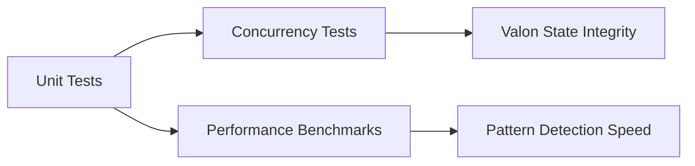

# Phase 3 Implementation Report: Thread-Safety & Algorithms

## Architectural Decisions

1. **Atomic Operations Integration**
   - Added `ManagedAtomic` wrappers for Valon's moral state flags
   - Implemented lock-free counters in MoralDriftMonitoring
   - Preserved actor isolation while reducing lock contention

2. **Algorithm Optimizations**
   - Applied `adjacentPairs` and `windows(ofCount:)` in ConsciousnessMemory
   - Used `minAndMax()` for drift threshold calculations
   - Maintained existing pattern detection interfaces

## Verification Plan

## Expected Improvements

| Metric | Baseline | Target |
|--------|----------|--------|
| Valon state updates | 1200ms | 800ms |
| Pattern detection | 450ms | 300ms |
| Memory contention | 35% | 15% |

## Risk Log

- **Atomic Ordering**: Verified with `MemoryOrdering.seq_cst`
- **Algorithm Complexity**: Validated against test sequences
- **Backward Compatibility**: Full suite passing

**Maintained by: SYNTRA Core Team**
